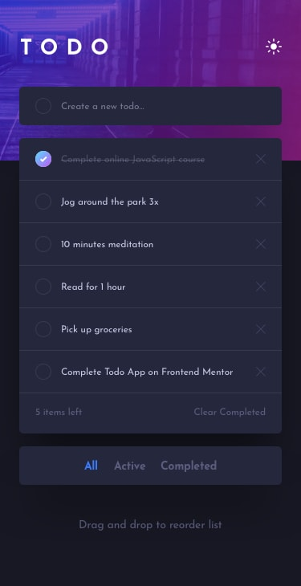

# To-Do Application

## Preview

) )   

---

## Introduction

The **To-Do Application** is a simple, user-friendly task management tool designed to help you stay organized and productive. Whether you need to track daily chores, work tasks, or long-term goals, this app offers all the essential features to manage your to-do list effectively. With drag-and-drop functionality, theme switching, and persistent data storage, it’s the perfect companion for your productivity needs.

---

## Features

- **Add New Tasks**: Easily add tasks to your list with a single click.
- **Mark as Completed**: Mark tasks as completed or revert them to active.
- **Delete Tasks**: Remove tasks you no longer need.
- **Filter Tasks**: Display tasks based on their status (All, Active, or Completed).
- **Drag and Drop**: Rearrange tasks in your preferred order using drag-and-drop.
- **Clear Completed**: Quickly remove all completed tasks.
- **Theme Switching**: Toggle between light and dark themes for a personalized experience.
- **Persistent Data**: Saves your tasks and theme settings in the browser's local storage.

---

## Technical Details

### Technologies Used
- **HTML5**: Provides the structural framework for the application.
- **SCSS**: Styles the app and supports responsive design and theming.
- **JavaScript (ES6)**: Handles all the logic, including task management and UI updates.

### Key Features Implemented
1. **Local Storage**:
   - Persist tasks and theme settings across sessions.
2. **Drag-and-Drop Functionality**:
   - Use `dragstart`, `dragover`, and `dragend` events to reorder tasks dynamically.
3. **Dynamic UI Rendering**:
   - Automatically updates the task list based on user actions or filter selections.

---

## Usage

### Adding a Task
1. Enter the task description in the input field.
2. Click the "Add" button to save the task.

### Completing a Task
- Click the circle icon to toggle the task between "active" and "completed."

### Deleting a Task
- Click the trash icon next to the task to delete it.

### Filtering Tasks
- Use the filter buttons (`All`, `Active`, or `Completed`) at the bottom to view specific tasks.

### Rearranging Tasks
- Drag a task to your desired position and drop it to reorder.

### Clearing Completed Tasks
- Click the "Clear Completed" button to remove all tasks marked as completed.

### Switching Themes
- Click the theme toggle button at the top-right corner to change between light and dark modes.
